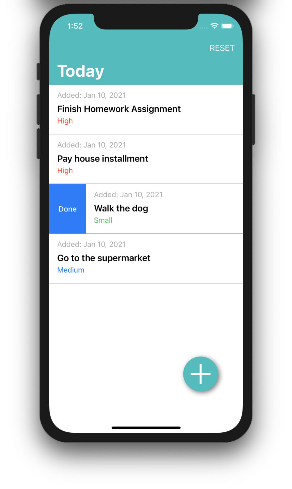
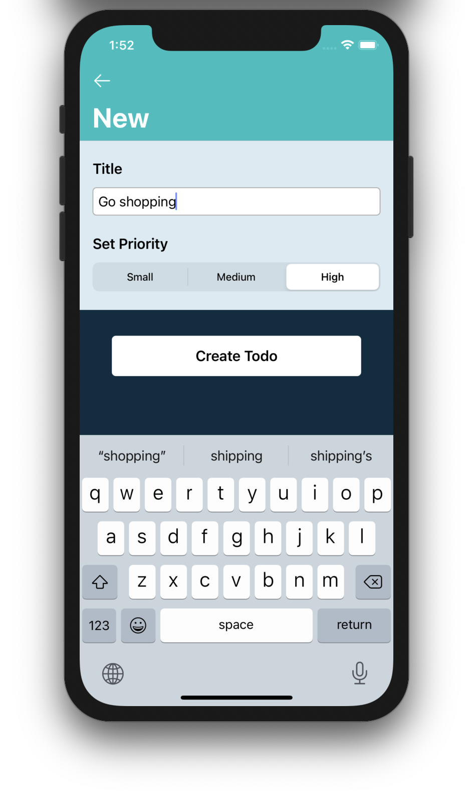

## TodoMaster

A simple Todo-List iOS application using Apple's CoreData Framework. 

**Technologies & Frameworks used:**

* Xcode 11
* Swift 5.2 
* UIKit 
* Core Data
* DiffableDataSource APIs

## Sample Screens 

    
    

